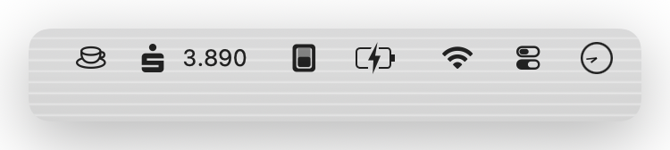

# simplebanking

<div align="center">


**macOS menu bar app that shows your current account balance — no decimals, auto-refreshed.**

Powered by [YAXI Open Banking](https://yaxi.de) · PSD2 · Pure Swift · No Node.js

[Download](#installation) · [Changelog](CHANGELOG.md) · [Contributing](CONTRIBUTING.md) · [Report a Bug](https://github.com/klotzbrocken/simplebanking/issues)

</div>

---

## Screenshot

<div align="center">
  
</div>

---

## Features

| Feature | Details |
|---|---|
| **Live Balance** | Booked balance directly in the menu bar (e.g. `1.234 €`) |
| **Transaction Panel** | Recent transactions with categories, merchant logos & financial health score |
| **Calendar Heatmap** | Monthly spending/income heatmap, drill-down to daily transactions |
| **Auto-Refresh** | Configurable interval (default: every 4 h); manual refresh via menu |
| **Any German Bank** | Works with all banks reachable via YAXI Open Banking (PSD2) |
| **Setup Wizard** | Enter IBAN — bank is discovered automatically |
| **SCA Support** | Push-TAN & OAuth redirect handled automatically |
| **Security** | AES-256-GCM + PBKDF2 · master password in Keychain · Touch ID / Face ID |
| **Auto-Update** | Ships with [Sparkle](https://sparkle-project.org/) for silent over-the-air updates |

---

## Installation

### Option A — Download DMG (recommended)

1. Go to [**Releases**](https://github.com/klotzbrocken/simplebanking/releases/latest).
2. Download `simplebanking-<version>.dmg`.
3. Open the DMG, drag **simplebanking.app** to `/Applications`.
4. Launch the app — a setup wizard guides you through connecting your bank.

> **Note:** The app is notarized by Apple. If macOS still blocks it, right-click → Open.

### Option B — Build from source

**Requirements:** macOS 13+, Xcode CLI tools, Swift 5.9+

```bash
# 1. Clone the repo
git clone https://github.com/klotzbrocken/simplebanking.git
cd simplebanking

# 2. Generate secrets (one-time setup — requires YAXI API credentials)
./make-secrets.sh "YOUR_YAXI_KEY_ID" "YOUR_YAXI_SECRET_BASE64"

# 3. Build an ad-hoc signed app bundle
./build-app.sh
# → output: SimpleBankingBuild/simplebanking.app

# 4. (Optional) Build + sign + notarize + DMG + appcast update
SIGN_IDENTITY="Developer ID Application: Your Name (TEAMID)" \
NOTARY_PROFILE="simplebanking-notary" \
./sign-and-notarize.sh
```

No `npm install`, no Node.js runtime needed.

---

## Architecture

```
Menu bar
  └─ Swift app (SwiftUI)
       └─ routex-client-swift (Swift Package)
            └─ YAXI Open Banking API
                 └─ Bank (PSD2)
```

Pure Swift — no embedded runtime, no JIT entitlement.
Session tokens are stored in `UserDefaults`; credentials are AES-GCM encrypted at `~/Library/Application Support/simplebanking/credentials.json`.

---

## Security

- Credentials encrypted with **AES-GCM + PBKDF2-SHA256** (210,000 iterations)
- Master password stored in macOS Keychain (`kSecAttrAccessibleWhenUnlockedThisDeviceOnly`)
- Credentials file permissions: `600` (owner read/write only)
- No credentials or IBAN written to log files
- SQL injection protection via parameterised queries + read-only query guard
- HTTPS for all API calls

---

## Dependencies

| Package | Purpose |
|---|---|
| [routex-client-swift](https://github.com/yaxi/routex-client-swift) | YAXI Open Banking Swift SDK |
| [GRDB.swift](https://github.com/groue/GRDB.swift) | Local transaction database (SQLite) |
| [Sparkle](https://sparkle-project.org/) | Auto-update framework |

---

## Contributing

Contributions are welcome! Please read [CONTRIBUTING.md](CONTRIBUTING.md) before opening a pull request.

---

## License

MIT — see [LICENSE](LICENSE).
